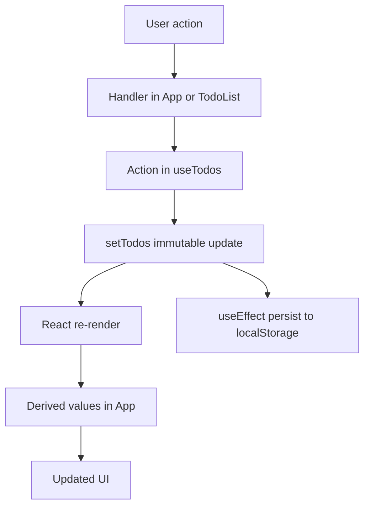
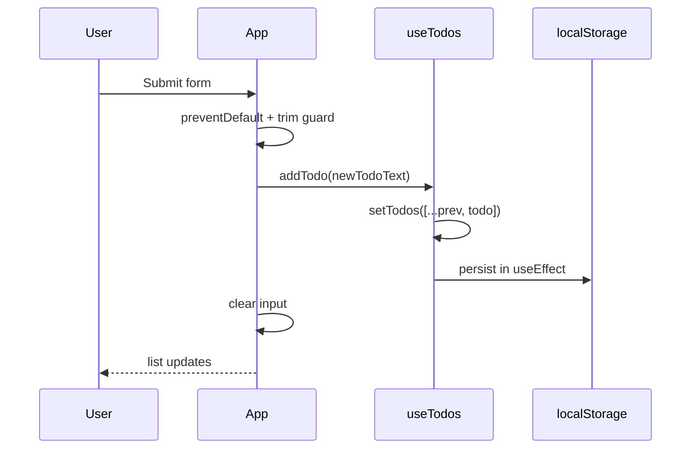
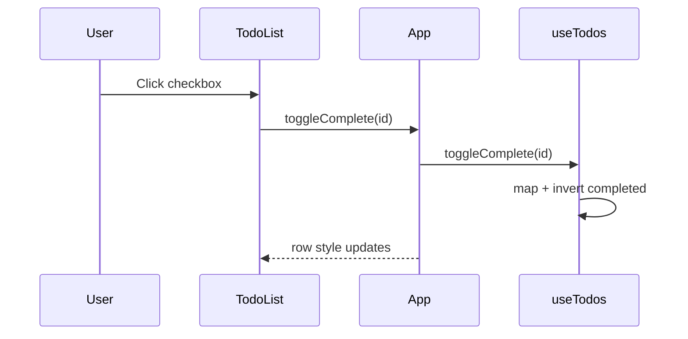
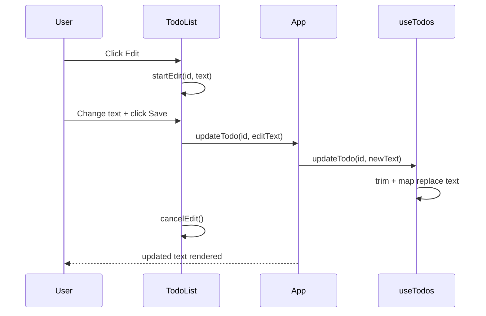
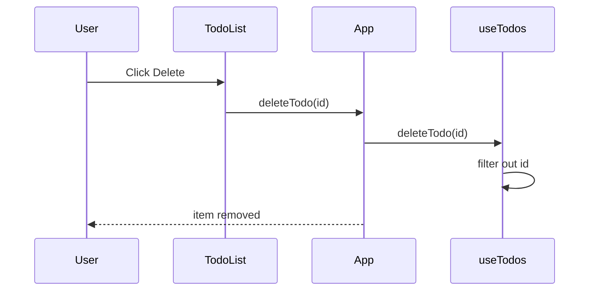
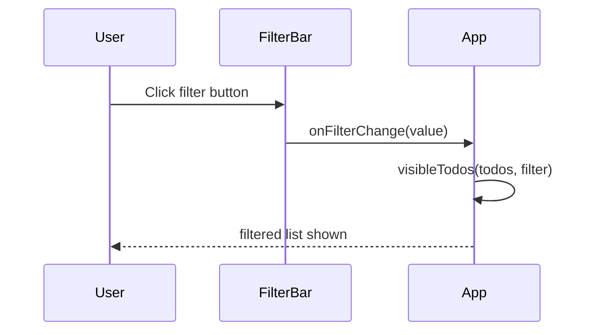
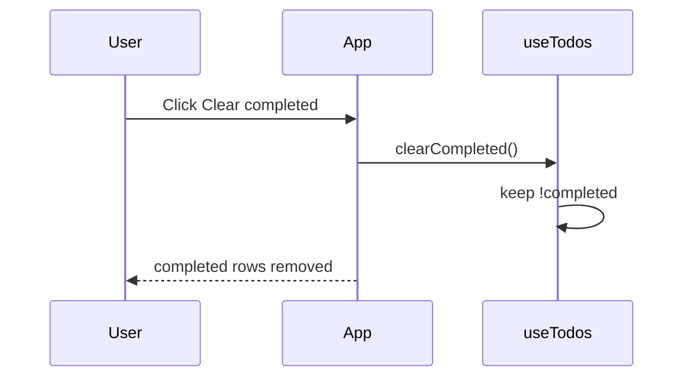
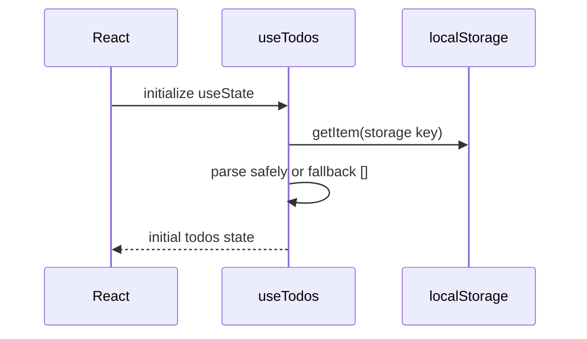

# Architecture Summary

## High-level architecture

This project is a single-page React + TypeScript Todos app with a clear separation of concerns:

- **Entry point**: `src/main.tsx`
- **Container/composition**: `src/App.tsx`
- **Domain state + persistence**: `src/hooks/useTodos.ts`
- **Presentational components**: `src/components/FilterBar.tsx`, `src/components/TodoList.tsx`
- **Type contracts**: `src/types/todo.ts`
- **Styling**: `src/App.css`, `src/index.css`

Data flow is one-way:

1. User interaction in UI.
2. App/component handler runs.
3. Hook action updates state immutably.
4. UI re-renders with derived values.
5. `useEffect` persists state to `localStorage`.

## ELI5: role of each file (what/how/why)

Think of this app like a small toy factory. Each file has one small job:

- `src/main.tsx`  
  What: turns the app on.  
  How: mounts `<App />` into the browser root element.  
  Why: without this file, nothing appears on screen.

- `src/App.tsx`  
  What: main page coordinator.  
  How: connects input, filter, list, and action handlers in one place.  
  Why: keeps shared todo state wiring in one clear top-level component.

- `src/hooks/useTodos.ts`  
  What: todo logic engine.  
  How: stores todos in React state, exposes actions, syncs with `localStorage`.  
  Why: separates business logic from UI so components stay simple.

- `src/components/FilterBar.tsx`  
  What: filter selector UI.  
  How: renders Active / Completed / All buttons and sends selected filter upward.  
  Why: gives a focused, reusable component for filter-only behavior.

- `src/components/TodoList.tsx`  
  What: todo rows UI.  
  How: displays list items and row actions (toggle, edit, delete) with inline edit state.  
  Why: keeps row rendering and edit interaction out of the app container.

- `src/types/todo.ts`  
  What: shared type contracts.  
  How: defines `Todo` shape and allowed `TodoFilter` values.  
  Why: gives compile-time safety and prevents invalid state shapes.

- `src/App.css`  
  What: app-level styling rules.  
  How: styles layout, buttons, list rows, inputs, and visual states.  
  Why: separates style concerns from TypeScript logic files.

- `src/index.css`  
  What: global base styles.  
  How: sets root-level defaults (font, spacing, page-level look and feel).  
  Why: keeps shared baseline styles centralized.

- `tsconfig.app.json`  
  What: TypeScript checker configuration.  
  How: enables strict mode and related compiler safety rules.  
  Why: catches type mistakes early during development.

- `instructions.md`  
  What: project assignment requirements.  
  How: lists feature spec, technical limits, and acceptance checklist.  
  Why: serves as the definition of done.

- `ARCHITECTURE_SUMMARY.md`  
  What: architecture documentation.  
  How: explains file responsibilities, data flow, and design decisions.  
  Why: helps reviewers and testers understand the project quickly.

## Component decomposition

### `src/main.tsx`

- Mounts `<App />` in `StrictMode`.
- Imports global stylesheet.

### `src/App.tsx`

Responsibilities:

- Compose page sections and child components.
- Keep page-level UI state:
  - `newTodoText: string`
  - `filter: TodoFilter`
- Consume domain API from `useTodos()`:
  - `todos`
  - `addTodo`, `toggleComplete`, `updateTodo`, `deleteTodo`, `clearCompleted`
- Compute derived values:
  - `itemsLeft`
  - `filteredTodos` via `visibleTodos`

Handlers:

- `handleNewTodoTextChange`
- `handleAddTodo`
- `handleToggleComplete`
- `handleDeleteTodo`
- `handleUpdateTodo`
- `handleClearCompleted`

### `src/components/FilterBar.tsx`

Responsibilities:

- Render segmented buttons for:
  - `all`
  - `active`
  - `completed`
- Display active state based on current filter.
- Emit intent upward via `onFilterChange`.

Helpers:

- `buttonClass(isActive)`
- `isActive(buttonFilter)`

### `src/components/TodoList.tsx`

Responsibilities:

- Render todo list rows.
- Render empty state when list is empty.
- Provide row actions:
  - toggle complete
  - edit inline (edit/save/cancel)
  - delete

Local UI state (`useState`):

- `editingId: number | null` (which row is in edit mode)
- `editText: string` (edit input buffer)

Helpers:

- `startEdit`
- `cancelEdit`
- `saveEdit`

### `src/hooks/useTodos.ts`

Responsibilities:

- Own source-of-truth todos state.
- Expose mutation actions for the app.
- Persist todos to `localStorage`.
- Expose filter helper function.

API returned by hook:

- `todos`
- `addTodo(text)`
- `toggleComplete(id)`
- `updateTodo(id, newText)`
- `deleteTodo(id)`
- `clearCompleted()`

Persistence:

- Reads initial value using `readStoredTodos()`.
- Writes on every `todos` change in `useEffect`.
- Storage key: `react-ts-todos.todos`.

Additional exported helper:

- `visibleTodos(todos, filter)`

### `src/types/todo.ts`

- `Todo`:
  - `id: number`
  - `text: string`
  - `completed: boolean`
- `TodoFilter`: `"active" | "all" | "completed"`

## Hooks and `useState` inventory

### `App.tsx`

- `useState<string>("")` for new todo input value.
- `useState<TodoFilter>("active")` for filter selection.

### `useTodos.ts`

- `useState<Todo[]>(readStoredTodos)` for canonical todos state.
- `useEffect` for persistence side effect.

### `TodoList.tsx`

- `useState<number | null>(null)` for edit mode row ID.
- `useState<string>("")` for inline edit text.

## Helper function inventory

### App handlers

- `handleNewTodoTextChange`
- `handleAddTodo`
- `handleToggleComplete`
- `handleDeleteTodo`
- `handleUpdateTodo`
- `handleClearCompleted`

### Hook helpers/actions

- `readStoredTodos`
- `addTodo`
- `toggleComplete`
- `updateTodo`
- `deleteTodo`
- `clearCompleted`
- `visibleTodos`

### TodoList helpers

- `startEdit`
- `cancelEdit`
- `saveEdit`

### FilterBar helpers

- `buttonClass`
- `isActive`

## Visual flows

### Overall state flow

### Add todo (Enter/submit)

### Toggle complete

### Inline edit

### Delete todo

### Filter list

### Clear completed

### Initial load / restore

## Design notes and tradeoffs

- `useTodos` centralizes domain logic and persistence, keeping `App` focused on composition.
- `TodoList` owns only transient UI editing state; persistent state remains in hook.
- Updates are immutable (`map`/`filter`), making behavior predictable.
- `readStoredTodos` validates that parsed data is an array, but does not deeply validate each item shape.
- Todo IDs currently use `Date.now()` for simplicity.

## Project checklist (spec, constraints, acceptance)

### Spec checklist

- [x] Add a new todo (controlled input, submit on Enter)  
  What: User can type and press Enter to add.  
  How: `newTodoText` controls the input; form `onSubmit` calls `handleAddTodo`, which calls `addTodo`.  
  Why: Controlled input keeps typed text and app state synchronized.

- [x] Mark a todo complete / incomplete (toggle)  
  What: Checkbox changes todo completion state.  
  How: Row checkbox calls `toggleComplete(id)`; hook flips `completed` with immutable `map`.  
  Why: Supports active/completed workflow and easy progress tracking.

- [x] Edit a todo inline  
  What: Todo text can be edited in place.  
  How: `editingId` selects edit mode row; `editText` stores draft text; Save calls `updateTodo(id, newText)`.  
  Why: Fast editing without opening a new page or modal.

- [x] Delete a todo  
  What: Single todo can be removed.  
  How: Delete button calls `deleteTodo(id)`; hook removes by `filter`.  
  Why: Required CRUD delete operation.

- [x] Filter view: All / Active / Completed  
  What: User can switch visible list subset.  
  How: `FilterBar` updates `filter`; `visibleTodos(todos, filter)` returns matching items.  
  Why: Lets user focus on relevant tasks.

- [x] Clear all completed todos in one action  
  What: Completed todos are removed together.  
  How: button calls `clearCompleted()`; hook keeps only todos where `completed` is false.  
  Why: Quick cleanup after finishing tasks.

- [x] Persist todos across page reloads (`localStorage` via custom hook)  
  What: Todos remain after browser refresh.  
  How: `readStoredTodos()` loads initial state; `useEffect` writes updated todos to `localStorage`.  
  Why: Prevents data loss in a backend-free app.

- [x] Counter showing "N items left"  
  What: App displays number of unfinished todos.  
  How: `itemsLeft` counts todos where `completed` is false.  
  Why: Gives immediate progress feedback.

- [x] Empty state when there are no todos  
  What: Message appears when list is empty.  
  How: `TodoList` renders `"No todos to show"` when `todos.length === 0`.  
  Why: Clear UX instead of blank space.

### Tech constraints checklist

- [x] React + Vite + TypeScript  
  What: Required frontend stack is used.  
  How: Project scripts and dependencies are Vite + React + TypeScript.  
  Why: Matches assignment platform and tooling constraints.

- [x] No CSS framework required (vanilla CSS used)  
  What: Styling is plain CSS.  
  How: UI styles are in `App.css` and `index.css`; no Tailwind/Bootstrap dependency.  
  Why: Keeps styling simple and compliant.

- [x] No backend (state is local + `localStorage` only)  
  What: No server calls or API storage.  
  How: Todos live in React state inside `useTodos` and sync to browser `localStorage`.  
  Why: Fits scope of a client-only assignment.

- [x] TypeScript strict mode on (`"strict": true`)  
  What: Strict type checks are enabled.  
  How: `tsconfig.app.json` has `"strict": true`.  
  Why: Catches type bugs early.

- [x] No `any` in codebase  
  What: No unsafe `any` type usage.  
  How: Types use `Todo`, `TodoFilter`, unions, and explicit parameter types.  
  Why: Maintains reliable type safety.

- [ ] Every function has an explicit return type  
  What: All functions should declare return type annotations.  
  How: Most handlers/actions do (`: void`, `: Todo[]`), but component functions still rely on inferred JSX return type.  
  Why: This is the only remaining gap for strict interpretation of the rule.

- [x] No Redux, no Zustand, no Next.js  
  What: No extra state/library/framework beyond React.  
  How: State is managed with React hooks only.  
  Why: Keeps architecture minimal per instructions.

### Acceptance criteria checklist

- [x] App scaffolded with Vite + React + TypeScript template  
  What: Base project is created with the required template stack.  
  How: Build/dev scripts and file structure align with Vite React TS setup.  
  Why: Ensures consistent environment for development and testing.

- [x] All CRUD operations work end to end  
  What: Create, read, update, delete are implemented in UI and state logic.  
  How: `addTodo`, list render, `updateTodo`, and `deleteTodo` are wired from UI to `useTodos`.  
  Why: Core functional goal of the todos app.

- [x] Filter view (All / Active / Completed) works correctly  
  What: Filter buttons produce expected list results.  
  How: `FilterBar` updates filter state; `visibleTodos` applies matching predicate.  
  Why: Validates correct state-based list projection.

- [x] Todos persist across full page reload  
  What: Data survives refresh.  
  How: Hook reads from and writes to `localStorage` using a stable key.  
  Why: Required persistence behavior with no backend.

- [x] At least one custom hook is used (named meaningfully)  
  What: Custom hook exists and has clear purpose.  
  How: `useTodos` encapsulates todo state, actions, and persistence.  
  Why: Demonstrates hook abstraction and separation of concerns.

- [x] State for the todo list lives at the appropriate level (lifted, not duplicated)  
  What: One source of truth for todos.  
  How: Canonical todos state is in `useTodos`; components receive props/callbacks instead of duplicating todo state.  
  Why: Prevents state drift and inconsistent UI.

- [x] At least 3 distinct components, each single-responsibility  
  What: UI is decomposed into focused components.  
  How: `App` (composition), `FilterBar` (filter controls), `TodoList` (list + row interactions).  
  Why: Improves maintainability and readability.

- [x] `npx tsc --noEmit` passes with zero errors  
  What: Type check succeeds.  
  How: Command runs successfully with exit code 0.  
  Why: Confirms compile-time type correctness.

- [x] No `any` anywhere in the codebase  
  What: No `any` type escape hatch is used.  
  How: Search in `src` returns no `any` matches.  
  Why: Meets strict typing requirement.
